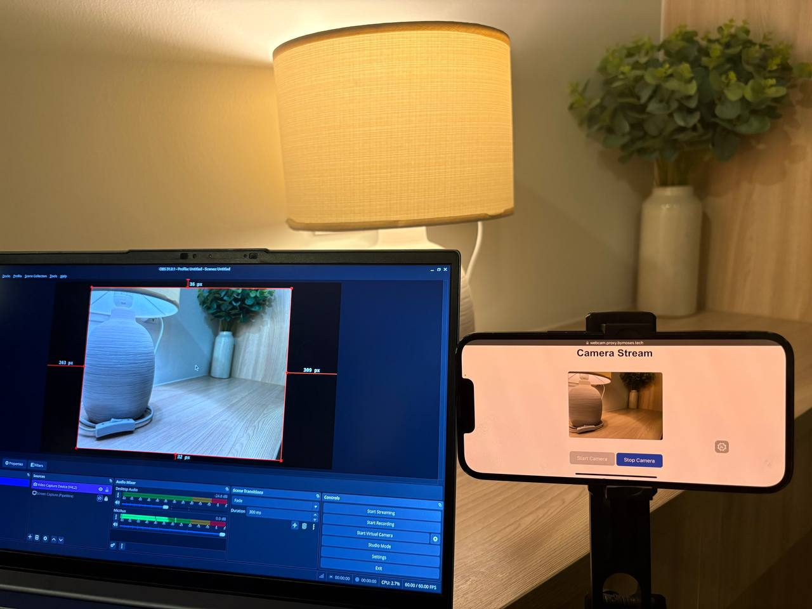

## Use your phone as your linux webcam

This project aims to be PoC of simplest and less hustle way of using your phone camera as linux webcam right inside your local network.

### How does it work?

1. In order to connect your phone to your host you need to have domain name or ability to change your router dns settings to point to your host local IP address.
   We have to use HTTPS in order to use phone camera on web (at least iPhone is not allowing to grant camera access on HTTP) and because we cannot create TLS directly with IP address so domain name is required.
2. Server is running behind reverse proxy which adds TLS. It serves html page and script when the phone is opened domain in browser.
3. When html page is loaded you can start camera and your phone establishes wss connection to server and starts to send jpeg frames from camera.
4. Server receives frames and pipe it to `ffmpeg` which outputs it to `v4l2loopback` device
5. And finally you can choose that camera in any app you want (tested in OBS, VLC, Firefox and Chrome)

### Requirements:

- Domain name pointing to your hosts local IP address (threre are a lot of ways to use it without domain name like connecting your phone through some proxy or changing dns on your router, but an actual domain name is the simplest solution)
- Self-signed certificate should be generated and imported to your phone browser ([iPhone tutorial](https://discussions.apple.com/thread/255176920?sortBy=rank))
  ```sh
  DOMAIN=proxy.example.com openssl req -x509 -newkey rsa:4096 -keyout $DOMAIN.key -out $DOMAIN.crt -days 3650 -nodes -subj "/O=$DOMAIN/CN=$DOMAIN" -addext "subjectAltName=DNS:*.$DOMAIN"
  ```
- loaded [v4l2loopback](https://wiki.archlinux.org/title/V4l2loopback) linux kernel module and created `/dev/videoX` loopback device
- Docker with [Traefik](https://doc.traefik.io/traefik/getting-started/quick-start/) up and running to serve TLS certificates
  _Or you can try run it without Docker, but you will need `ffmpeg` and `bun` and reverse-proxy of choice_

### How to use:

1. In `compose.yml` file replace domain name in traefik labels section with the one you configured. Also check v4l2 device path, and traefik network name
2. In `src/public/video-streamer.js` edit `SERVER_URL` variable with your domain name
3. In `src/server.js` edit `V4L2_DEVICE` variable with your device path
4. Run docker compose:
   ```sh
   docker compose up --build -d
   ```
5. Open your domain on your phone and press Start Camera
6. To test it open https://webcamtests.com/ , grant access to your virtual camera and pick it as source

### TODO:

1. Dynamic camera facingMode switching
2. Presets dropdown with HxW@framerate like 640x480@30, 1280x720@60 etc
3. Use WebRTC instead of WebSockets
4. Figure out how to make it without constant rendering to virtual canvas
